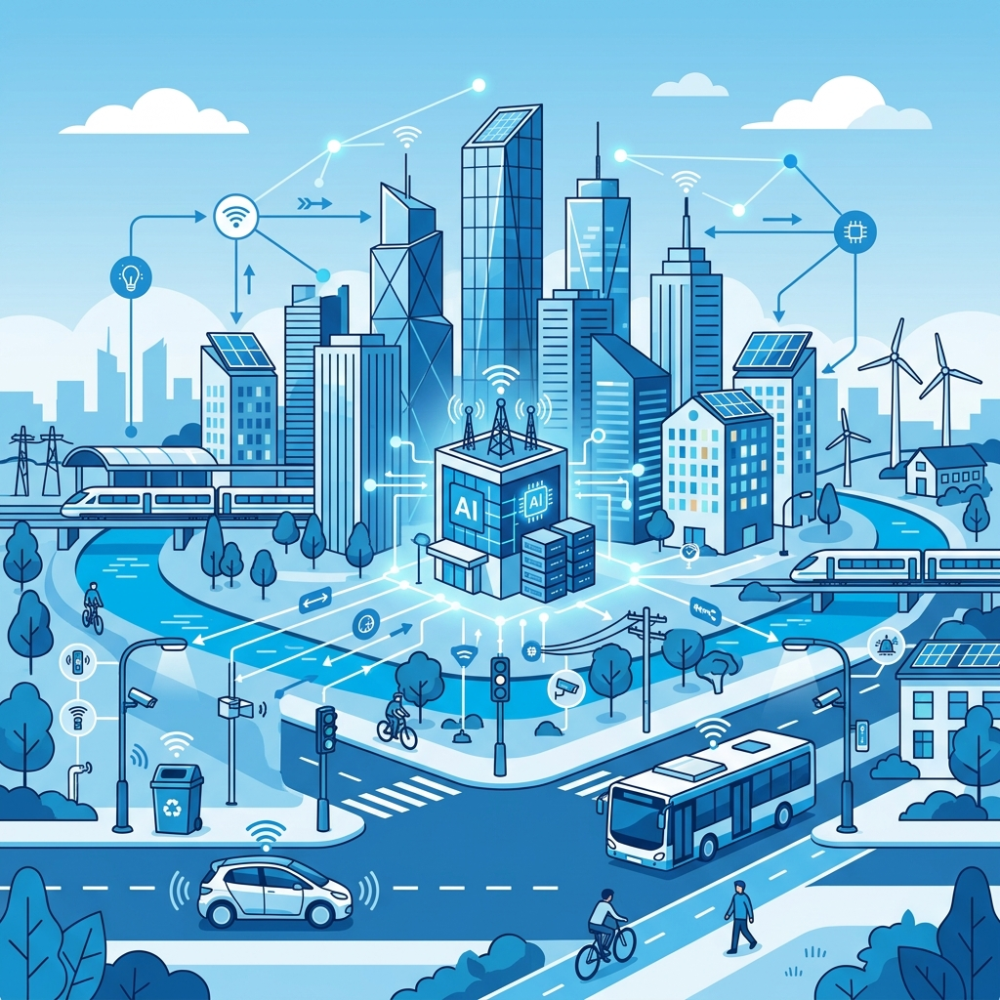
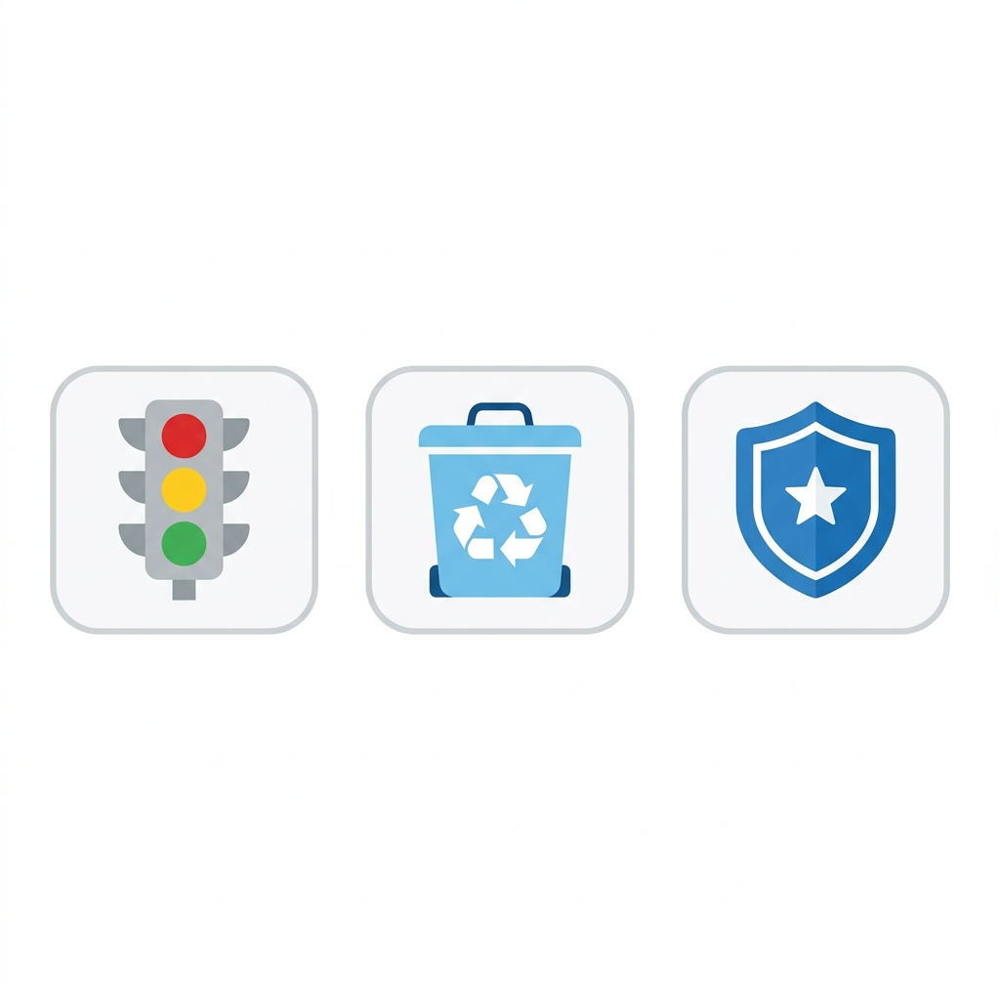
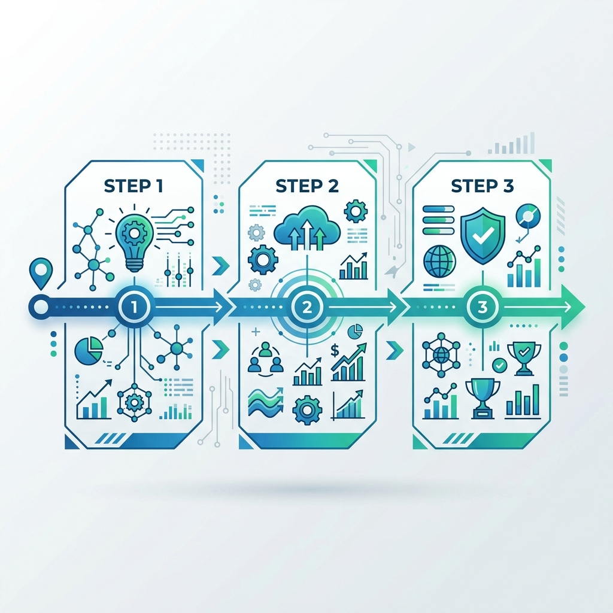

# 🏙️ Riverland City Council: Community Innovation Forum
**Topic:** Improving Public Services with Emerging Technologies
**Drafted by:** Mike & Datacom AI Partner

---

## Slide 1: Emerging Tech Trends in Local Government

**Key Technologies Transforming Public Services:**
1. **The Internet of Things (IoT):** Networks of connected sensors collecting real-time data from city infrastructure (like streetlights and water pipes).
2. **Artificial Intelligence (AI):** Systems that analyze massive amounts of city data to predict trends, automate responses, and optimize resource allocation.
3. **Smart Infrastructure:** Physical assets built with embedded technology to adapt to environmental changes instantly.

🗣️ **Speaker Notes:**
> *"Welcome, everyone. Today we are exploring how emerging technology isn't just about flashy gadgets—it's about fundamentally improving the services we rely on every day. Three key technologies are leading this charge: IoT sensors that give our city 'nervous systems', AI that acts as the 'brain' to process data, and Smart Infrastructure that physically adapts to community needs in real-time."*

---

## Slide 2: Primary Community Challenges

**What are we trying to solve?**
- **🚦 Traffic Congestion:** Growing populations are overwhelming traditional intersections and transit routes, leading to delays and pollution.
- **♻️ Waste Management Inefficiencies:** Static garbage collection schedules lead to overflowing public bins and wasted fleet fuel on empty bins.
- **🛡️ Public Safety & Emergency Response:** First responders face delays navigating unpredictable urban obstacles and routing issues.

🗣️ **Speaker Notes:**
> *"Before we talk about solutions, we must ground ourselves in the actual challenges our growing Riverland community faces. As our population expands, we're seeing increased bottlenecks in traffic, inefficiencies in how we handle waste management, and the need for rapidly deploying emergency services through busy streets. These are the core targets we want to address."*

---

## Slide 3: Tech-Enabled Solutions & Next Steps

**The Smart City Roadmap:**
1. **Traffic Optimization:** AI analyzes data from IoT cameras to instantly alter traffic light patterns, clearing bottlenecks dynamically.
2. **Smart Waste Fleets:** Sensors inside public bins notify management *only* when full, optimizing the route of waste collection vehicles.
3. **Automated Emergency Routing:** Smart infrastructure communicates with emergency vehicles to clear traffic pathways in real-time.

**Next Steps / Call to Action:**
🎯 **Recommendation:** Establish a 'Smart City Pilot Group' starting next month to trial IoT traffic sensors at our 3 busiest intersections.

🗣️ **Speaker Notes:**
> *"How do we bridge the gap? By pairing the technologies from slide one with the problems from slide two. AI can reprogram traffic lights in real-time to alleviate congestion. IoT sensors can tell our waste trucks exactly which bins need emptying, saving fuel. Our recommendation to action this today is to launch a Smart City Pilot Group next month, focusing initially on traffic sensors at our three worst intersections to prove immediate ROI."*

---
